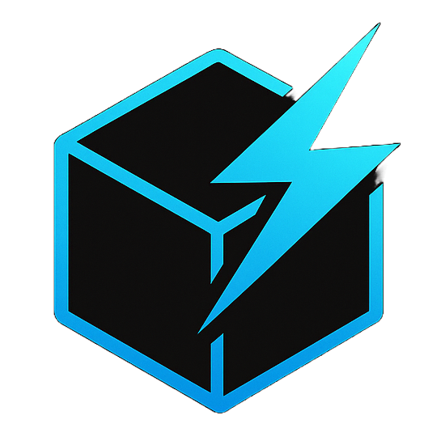
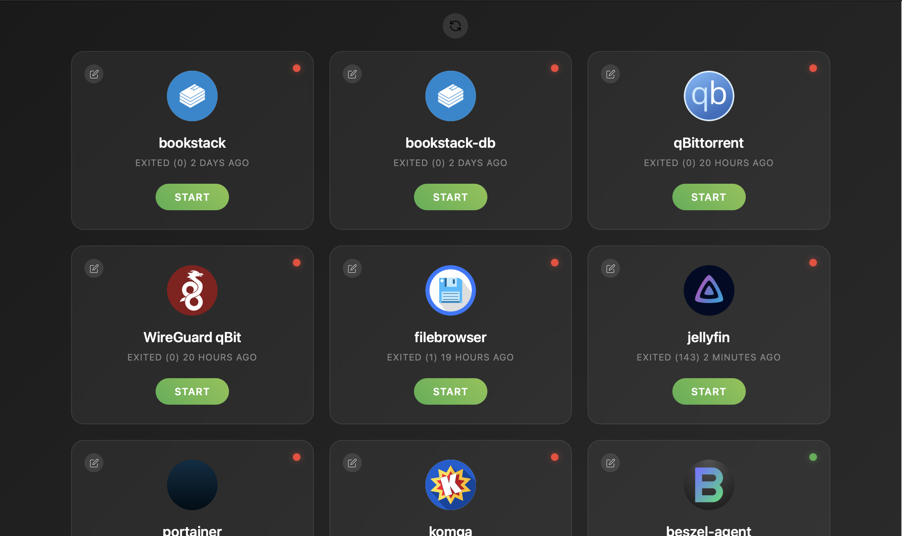
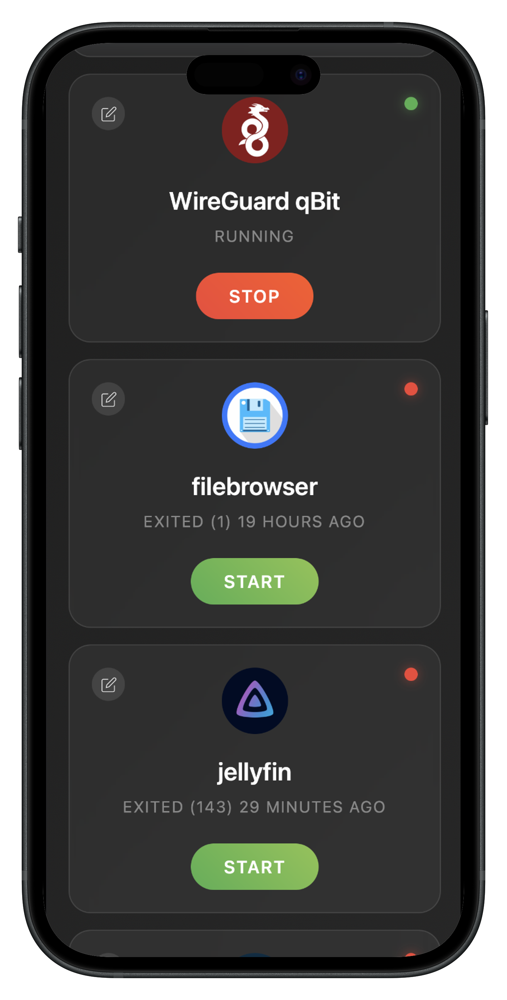
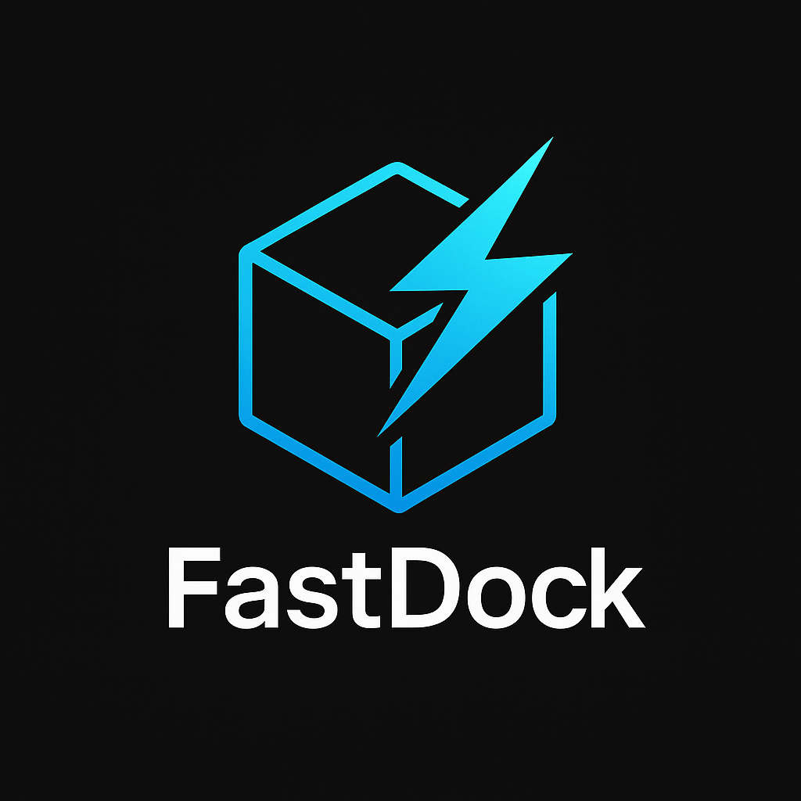

# Fastdock

A simple web-based Docker container management interface with a modern design. This application provides a fast and intuitive way to start and stop Docker containers on the go through a beautiful web interface.

🎯 [Live Demo](https://fastdock.salvatoremusumeci.com)




## ⚠️ Security Notice

**This application is designed for internal use only and should be deployed behind a VPN or in a secure network environment.**

* No authentication or authorization mechanisms
* Direct access to Docker daemon
* File upload capabilities without advanced validation
* Suitable for development/staging environments only

## ✨ Features

* **Real-time Container Management**: Start and stop Docker containers
* **Multi-Server Management**: Manage Docker containers across multiple servers from a single interface
* **Server Selector**: Quickly switch between local and remote servers
* **Add/Edit/Delete Servers**: Configure remote servers with custom name, address, and port
* **Server-Aware Display**: Container cards show which server they belong to
* **Custom Container Icons**: Upload custom icons for better visual identification
* **Container Renaming**: Assign custom names to containers
* **Responsive Design**: Works seamlessly on desktop, tablet, and mobile devices

## 🚀 Quick Start

### Prerequisites

* Node.js >= 16.0.0
* Docker daemon running
* Docker socket accessible (`/var/run/docker.sock`)

### Installation

1. **Clone the repository**

```bash
git clone https://github.com/totovr46/fastdock.git
cd fastdock
```

2. **Install dependencies**

```bash
npm install
```

3. **Start the application**

```bash
npm start
```

4. **Access the interface**
   Open your browser and navigate to `http://serverIP:3080`

## 📋 API Endpoints

### Container Operations

* `GET /api/containers` - List all containers on the selected server
* `POST /api/containers/:id/start` - Start a container
* `POST /api/containers/:id/stop` - Stop a container
* `GET /api/containers/name/:name` - Find container by name

### Container Settings

* `POST /api/containers/settings/:id` - Update container settings (name, icon)
* `GET /api/containers/settings` - Get all container settings

### Server Management

* `GET /api/servers` - List configured remote servers
* `POST /api/servers` - Add a new server
* `PUT /api/servers/:id` - Edit an existing server
* `DELETE /api/servers/:id` - Remove a server

## 🛠️ Development

### Project Structure

```
fastdock/
├── server.js                  # Main server file
├── package.json              # Dependencies and scripts
├── public/
│   ├── index.html            # Main web interface
│   ├── assets/               # Uploaded container icons
│   ├── containerSettings.json # Container customization data
│   └── servers.json          # Stored remote server configurations
└── README.md
```

## 🔧 Configuration

### Environment Variables

* `PORT` - Server port (default: 3080), you can change it in the server.js file as you prefer

### Docker Socket

The application requires access to the Docker socket. Ensure Docker is running and the socket is accessible:

**Linux/macOS:**

```bash
ls -la /var/run/docker.sock
```

**Windows (WSL):**

```bash
# Ensure Docker Desktop is running
docker ps
```

## 🚦 Usage

### Basic Operations

1. **Select Server**: Use the dropdown menu to choose a local or remote server
2. **View Containers**: See all containers for the selected server
3. **Start/Stop**: Use the buttons to manage containers as usual
4. **Edit Container**: Click the pencil icon to change name or icon

### Container Customization

1. Click the edit icon (pencil) on any container card
2. Upload a custom icon (image files only)
3. Set a custom name for easier identification
4. Click "Save" to apply changes

### Server Management

1. Click the server selector dropdown
2. Select "Add Server" to configure a new remote Docker server
3. Use the edit or delete options to manage existing servers
4. Server data is persisted and automatically loaded on startup

### Status Indicators

* 🟢 **Green**: Container is running
* 🔴 **Red**: Container is stopped

## 🔐 Security Considerations

### Network Security

* **Deploy behind VPN**: Ensure the application is only accessible through a secure VPN connection
* **Internal Network**: Use only in trusted internal networks

### File Upload Security

* Only image files are accepted for container icons
* Files are stored in the `public/assets/` directory

### Docker Access

* The application requires Docker socket access
* All VPN users will have full container management capabilities
* Consider Docker socket security best practices

## 🚨 Limitations

* **No User Authentication**: All users have the same access level
* **No Audit Logging**: Container operations are not logged
* **Local Storage**: Settings are stored in local JSON files
* **Single Instance**: Not designed for multi-instance deployment

## 🛌 Multi-Server Support

As of **v1.1.0**, FastDock supports managing containers across multiple Docker hosts. Key points:

* Add servers with custom name, address, and port
* Switch between servers using the dropdown selector
* View and manage containers per-server
* Each container shows the server it belongs to
* Full backwards compatibility with single-server setups
* Server list and settings are persisted locally

## 🤝 Contributing

1. Fork the repository
2. Create a feature branch (`git checkout -b feature/amazing-feature`)
3. Commit your changes (`git commit -m 'Add amazing feature'`)
4. Push to the branch (`git push origin feature/amazing-feature`)
5. Open a Pull Request

---

**⚠️ Important**: This application provides direct access to Docker containers. Use only in secure, controlled environments with trusted users.

